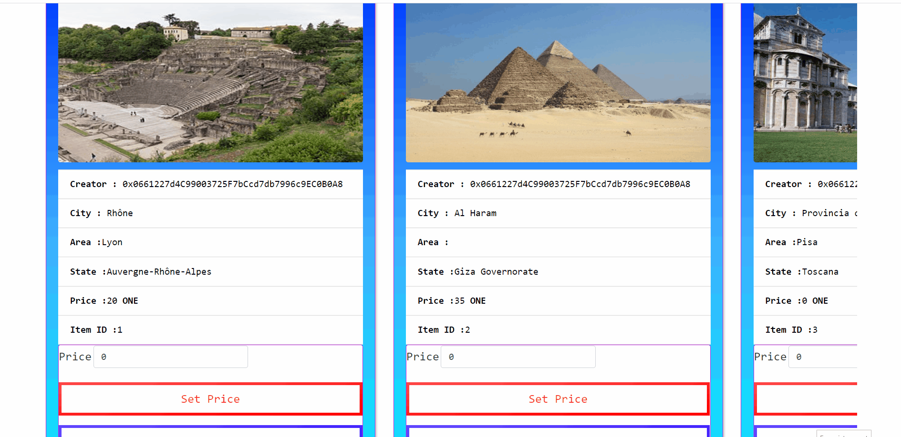

# Geospatial NFT
## Location Search | Mint NFT | Set Price & Buy


## Description :
This is a submission for Harmony Hackathon (Harmony-One-Love-2). ONE World: Geospatial NFT Marketplace.

Demo App for Draggable marker to position, Upload (City, Area, State, real world image) to IPFS and Mint the NFT.

the NFT appear in the buttom containe information, and let to Set the Price of the NFT for Owner, and let to Buy the NFT for other users.

## Marketplace of NFTs
<p align="center">
  
</p>

## Use :

1. Get your API Key from [developers.google.com](https://developers.google.com/maps/documentation/javascript/get-api-key).
2. Add your Google Maps Key in `./client/src/client-config.js`

``` ruby
GoogleMapsAPI = '';

```
3. Add your TEST Private key and MNEMONIC in `.env` file
4. Contract already deployed in TESTNET with the address :  0xc1987e8Eac47Ac0E67316646EB27820a48c1eaEA

## Installation Instructions :

1. Clone the repo using `git clone https://github.com/L-KH/Geospatial-NFT-Harmony.git`
2. `cd Geospatial-NFT-Harmony`
3. `npm install`
4. `npm start`

## Compile and Migrate :
1. `npm install -g truffle`
2. `truffle compile`
3. `truffle migrate --network testnet --reset`

## Mint NFT Demo :
<kbd></kbd>

## Set Price Demo :
<kbd></kbd>

## Buy NFT Demo :
<kbd></kbd>


## Info:
<b>Twitter :</b> https://twitter.com/lahcen_kha

<b>Gitcoin :</b> https://gitcoin.co/l-kh


